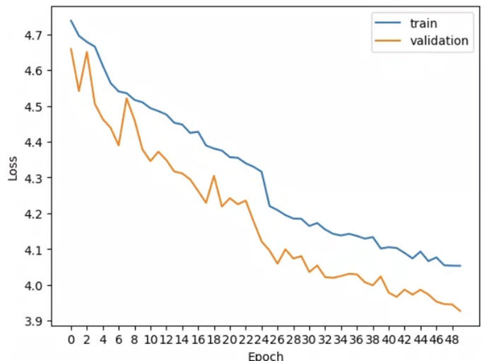
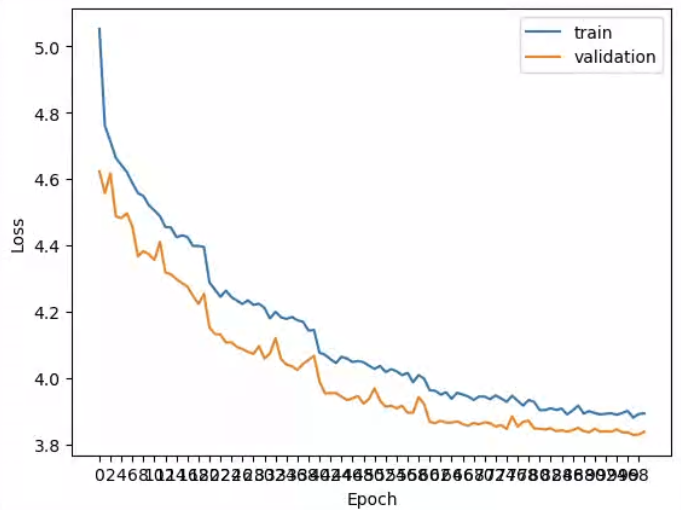
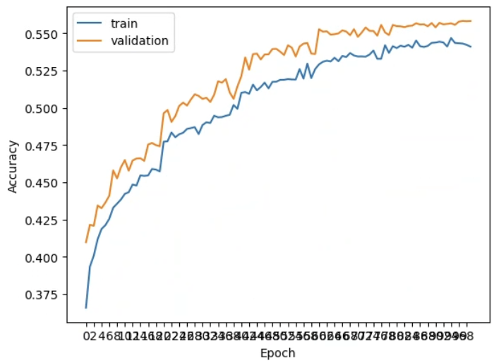

# Training Vision Transformers using the Pascal VOC 2012 dataset for multi-label classification task

## Pascal VOC 2012 dataset

The dataset contains about 11,530  labelled images facilitated for numerous vision tasks including Classifications.
There are 20 Object Categories:  'aeroplane', 'bicycle', 'bird', 'boat',
                     'bottle', 'bus', 'car', 'cat', 'chair',
                     'cow', 'diningtable', 'dog', 'horse',
                     'motorbike', 'person', 'pottedplant',
                     'sheep', 'sofa', 'train', 'tvmonitor'

## Training

* Vision Transformer is trained using Pytorch Library
* Pytorch library `torchvision.datasets.VOCDetection` is used as Dataset for the DataLoader
* Loss criteria : `BCEWithLogitsLoss`
* Evaluation : Mean Average Prediction of labels

For the full training pipeline - refer to ipynb file

| Hyperparameter | Values - Trained from Scratch | Values - Pretrained from ImageNet |
| ------------- | ------------- | ------------- |
| Input Image Size  | 224 x 224  | 224 x 224  |
| Batch size  | 20  | 20  |
| Epochs  | 50  | 15  |
| Optimizer  | SGD with momentum(gamma - 0.3  | SGD with momentum / gamma - 0.3  |
| Learning rate  | 1e-3 | 5e-5  |
| Scheduler  | StepLR  | StepLR  |
| Momentum  | 0.9  | 0.9  |

## Performance

### ViT Tiny pretrained on ImageNet
#### Loss

#### mAP

### ViT Tiny trained from scratch
#### Augmentation
              `RandomChoice(
               ColorJitter(brightness=(0.8, 1.2), contrast=None, saturation=None, hue=None)
               RandomGrayscale(p=0.25)
               )
               RandomHorizontalFlip(p=0.25)
               RandomRotation(degrees=[-25.0, 25.0], interpolation=nearest, expand=False, fill=0)`

#### Loss (50 Epochs)

#### mAP mAP (50 epochs)

#### Loss and mAP (100 epochs) 

### ViT Tiny trained from scratch
#### 3 Augmentation ([DeiT III: Revenge of the ViT](https://arxiv.org/abs/2204.07118)
              `RandomCrop(size=(224, 224), padding=4)
               RandomHorizontalFlip(p=0.5)
               RandomChoice(
               RandomGrayscale(p=1.0)
               RandomSolarize(threshold=60,p=1.0)
               GaussianBlur(kernel_size=(7, 13), sigma=(0.1, 2.0))
               )
               ColorJitter(brightness=(0.8, 1.2), contrast=None, saturation=None, hue=None)`

#### Loss (50 Epochs)
 

#### mAP (50 epochs)
 

#### Loss and mAP (100 epochs) 
- Model generalizes well when trained with 3-Augment

#### mAP on Test 
0.561
## Results

* Trained model path is trained_models/vit_pretrained/model/model-val-1005.pth
* Prediction scores are in trained_models/vit_pretrained/results/scores_wth_gt-1005.csv

